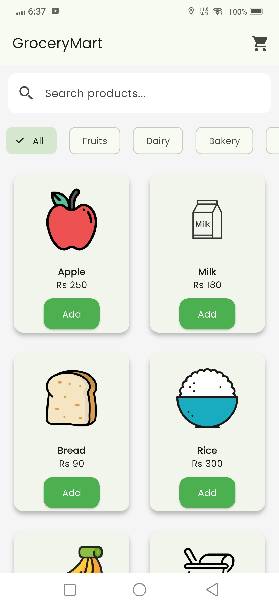
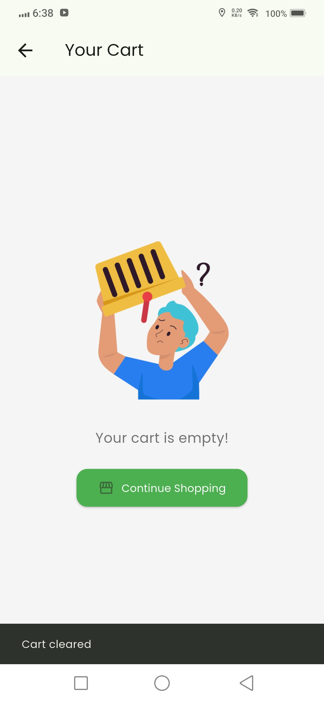
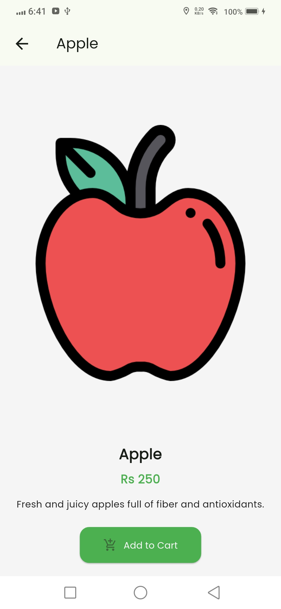

# 🛒 GroceryMart – Flutter Grocery App

GroceryMart is a sleek and responsive Flutter application for browsing, searching, and managing grocery items. It includes category-based filtering, a cart system, product details, and a polished UI with a splash screen and app icon.

---

## 🚀 Features

- 🔍 **Search & Category Filter**
- 🛒 **Add to Cart + Quantity Management**
- 📦 **Product Detail Page with Descriptions**
- 💚 **Empty Cart Illustration + Continue Shopping**
- 🌱 **Clean UI using Poppins Font & ThemeData**
- 📱 **Splash Screen & Custom App Icon**
- 💾 **Cart Persistence using SharedPreferences**

---

## 📂 Folder Structure
```plaintext
lib/
├── models/            # Product and cart models
├── providers/         # Cart provider
├── screens/           # Home, Cart, and Product Detail screens
├── services/          # Product data source
└── main.dart          # Entry point

yaml
dependencies:
  flutter:
    sdk: flutter
  provider: ^6.1.1
  shared_preferences: ^2.2.2
  cupertino_icons: ^1.0.8

dev_dependencies:
  flutter_launcher_icons: ^0.13.1
  flutter_native_splash: ^2.4.0
  flutter_test:
    sdk: flutter
  flutter_lints: ^5.0.0
 ```
## 🚀 Getting Started

### 📋 Prerequisites

- Flutter SDK
- Android Studio or VS Code
- Git
- Android Emulator or Physical Device

### ⚙️ Installation

Clone the repository and run the app:

```bash
git clone https://github.com/AishaAli1543/grocery_mart.git
cd grocery_mart
flutter pub get
flutter run
```
## ✅ Features Implemented

- 🛍️ **Product Listing**  
  Displays grocery items in a responsive grid layout using `GridView`.

- 📂 **Category Filtering**  
  Filter products based on categories using horizontal `ChoiceChip`.

- 🔎 **Search Functionality**  
  Real-time search bar that filters product list based on user input.

- 🛒 **Cart Functionality**  
  - Add products to cart  
  - Increase or decrease quantity  
  - Remove items from cart  
  - Display total price and quantity

- 💾 **Cart Persistence**  
  Cart data is stored locally using `shared_preferences`, so the cart is not lost on app restart.

- 📄 **Product Detail Screen**  
  Displays a detailed view with product image, name, price, and description.

- 🧺 **Empty Cart Illustration**  
  Shows an image and "Continue Shopping" button when the cart is empty for a better user experience.

- 🎨 **Custom UI & Font**  
  Styled using `ThemeData`, rounded cards, and the `Poppins` font.

- ✨ **Splash Screen**  
  Implemented using `flutter_native_splash` with a custom logo.

- 🧩 **State Management**  
  Uses `Provider` and `ChangeNotifier` for reactive UI updates across the app.
  ## 📸 Screenshots

### 🏠 Home Screen


### 🧺 Empty Cart


### 📄 Product Detail



